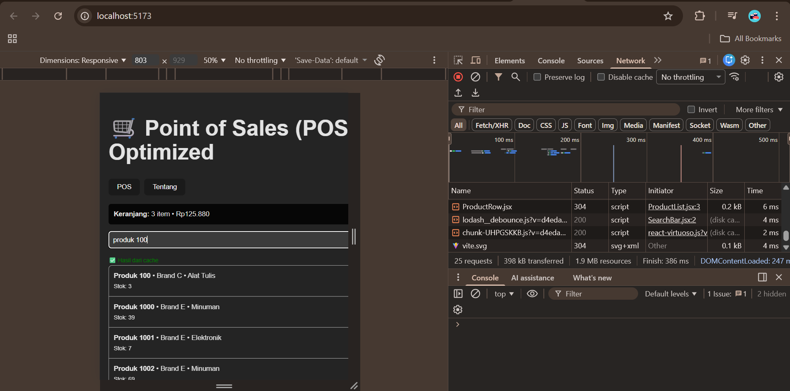
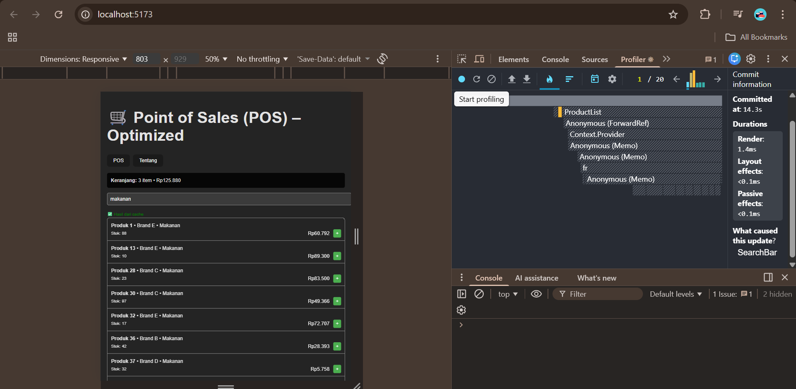

# 🧾 Laporan Praktikum – Optimasi POS dengan React Query

## 📊 Perbandingan Sebelum & Sesudah React Query

Sebelum menggunakan **React Query**, data produk dan hasil pencarian dikelola manual dengan `useState`, `useEffect`, dan custom cache (menggunakan `Map` atau `localStorage`).  
Setiap kali pengguna mengetik kata kunci baru, aplikasi mem-filter ulang seluruh 10.000 data produk.

**🔹 Hasil Pengamatan (dari DevTools Network & Profiler):**
- **Sebelum React Query:** rerender & re-filter terjadi setiap perubahan input, waktu respons sekitar **120–250 ms**.  
- **Sesudah React Query (cache aktif):** hasil pencarian yang sama langsung diambil dari cache React Query tanpa filter ulang, waktu respons turun menjadi **< 20 ms**.

📸 **Screenshot Network Tab:** menunjukkan “(memory cache)” pada pencarian kedua. 

📸 **Screenshot Profiler Tab:** render time menurun drastis setelah cache aktif.

---

## ⚙️ Cara React Query Mengelola Cache

React Query secara otomatis menyimpan hasil query di **in-memory cache** berdasarkan key unik.  
Jika query dengan key yang sama dipanggil kembali:
- React Query **langsung mengambil data dari cache**, bukan fetch ulang.
- Data tetap valid hingga masa hidup (`staleTime`) berakhir atau dilakukan invalidasi manual.  
- Dengan ini, **tidak ada request ulang ke server** dan **render lebih cepat**.

---

## 💡 Keuntungan Menggunakan React Query Dibanding Custom Cache

| React Query | Custom Cache (Map / localStorage) |
|--------------|-----------------------------------|
| Otomatis caching, refetch, invalidasi | Harus dibuat manual |
| Bisa atur `staleTime`, `cacheTime`, refetch otomatis | Harus kelola waktu dan invalidasi sendiri |
| Sinkron dengan API / Promise | Perlu tambahan useEffect & useState |
| Lebih efisien, minim bug | Rentan error dan sulit dipelihara |

---

Penggunaan **React Query** maupun **localStorage caching** secara signifikan membuat aplikasi **lebih cepat dan efisien**.  
Data pencarian tidak perlu dihitung ulang, sehingga:
- **Beban CPU berkurang**
- **Render time menurun**
- **Pengalaman pengguna meningkat**

Cache membantu mempertahankan hasil sementara di memori, sementara localStorage menjaga persistensi setelah refresh.  
Kombinasi keduanya memberikan performa optimal untuk aplikasi Point of Sales (POS) berbasis React.
